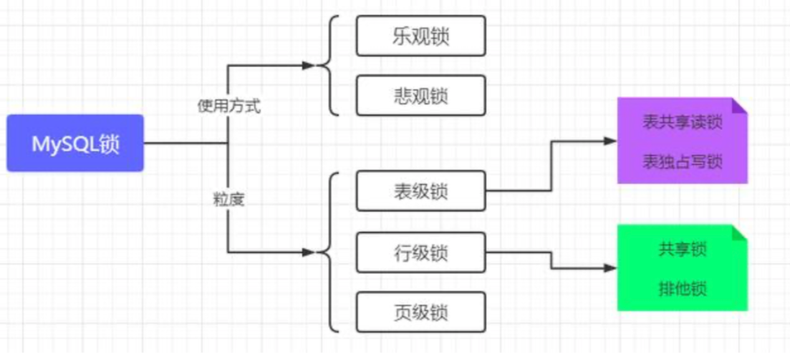
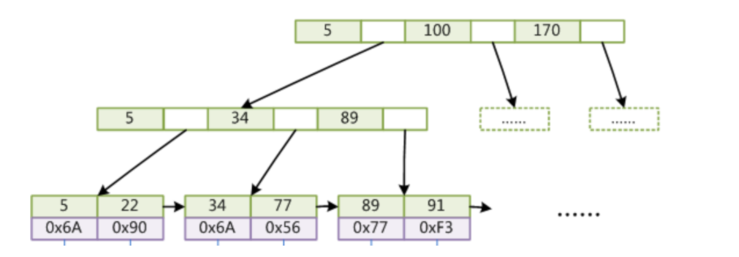
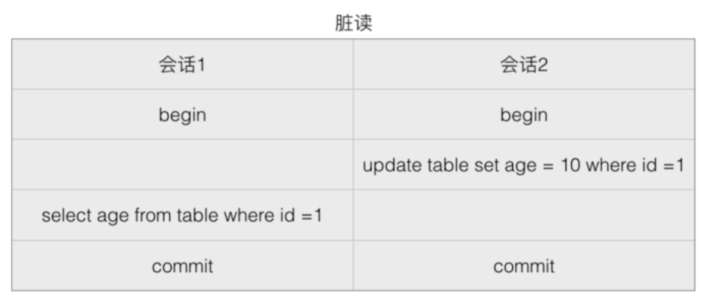
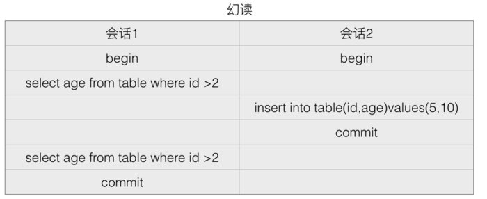
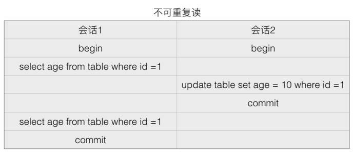
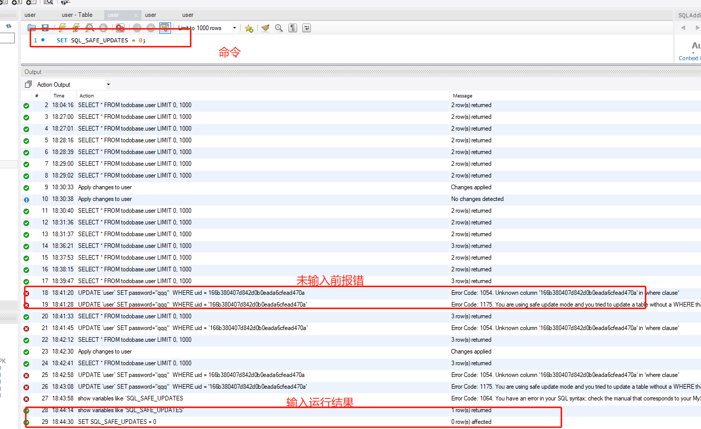
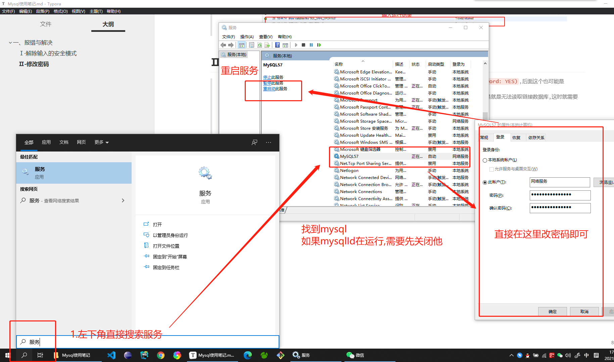

# 🌈Mysql基础

[Mysql常用查询语句呀](./mysql.md)


# 一、mySQL锁

>在我们平时开发中可能很少考虑锁的问题(特别是做前端的时候),这是因为数据库隐式帮我们添加了锁:
>
>* 对于`UPDATE、DELETE、INSERT`语句,InnoDB(*mySQL的数据库引擎之一,现为MySQL的默认存储引擎*)会自动将涉及的数据集添加 **排他锁(X锁)**
>* 事务拿到某一行记录的 **共享锁(S锁)** 才可以读取这一行,并阻止其他事务对其添加排他锁
>* 事务拿到一行记录的 **排他锁(X锁)** 才可以修改或和删除这一行
>
>##### 共享锁的目的是为了提高读取的并发;排他锁的目的时为了保证数据的一致性
>
>我们在某些特定的场景下才需要手动进行加所,学习数据库锁知识就是为了:
>
>* 更好地控制程序代码
>* 能让我们在特定场景上派上用场
>* 构建自己的数据库知识体系
>
> 

## 1、悲观锁

>悲观锁（Pessimistic Lock），顾名思义，就是很悲观，每次去拿数据的时候都认为别人会修改，所以每次在拿数据的时候都会上锁，这样别人想拿这个数据就会block直到它拿到锁。
>
>* 悲观锁：假定会发生并发冲突，屏蔽一切可能违反数据完整性的操作。
>* Java synchronized 就属于悲观锁的一种实现，每次线程要修改数据时都先获得锁，保证同一时刻只有一个线程能操作数据，其他线程则会被block。
>* `共享锁`与`排他锁`都是**悲观锁**的范畴

### Ⅰ- 注意点

>要使用悲观锁我们就必须先关闭Mysql数据库的自动提交属性,因为Mysql默认使用 autocommit 模式
>
>也就是说当你执行一个更新操作,Mysql会立即将结果进行提交
>
>###### 排他锁与共享锁是悲观锁的不同实现,他们都属于悲观锁的范畴
>
>```java
>/**
>    * 更新库存(使用悲观锁)
>    * @param productId
>    * @return
>*/
>    public boolean updateStock(Long productId){
>        //先锁定商品库存记录
>        ProductStock product = query("SELECT * FROM tb_product_stock WHERE product_id=#{productId} FOR UPDATE", productId);
>        if (product.getNumber() > 0) {
>            int updateCnt = update("UPDATE tb_product_stock SET number=number-1 WHERE product_id=#{productId}", productId);
>            if(updateCnt > 0){    //更新库存成功
>                return true;
>            }
>        }
>        return false;
>    }
>```

### Ⅱ- 排他锁

>排他锁与共享锁相对应,就是指对于多个不同事务,对同一个资源只能有一把锁,与共享锁类似,在需要执行的语句后面加上 `for update` 就可以了
>
>* 用域数据修改操作,例如:`UPDATE、DELETE、INSERT`语句.确保不会同时对同一资源进行多重更新
>* 如果事务T对数据A加上排他锁后,则其他事务不能再对A加任何类型的封锁.
>* 获准排他锁的数据技能读取数据还能修改数据

### Ⅲ - 共享锁

>**共享锁(S锁)** 用于不更改或不更新数据的操作(只读操作),例如`SELECT`语句
>
>如果事务T对数据A加上共享锁后: **其他事务只能对A再加共享锁,不能加排他锁.获准共享锁的事务只能读数据,不可修改数据**

#### 举个栗子

>1. 开启共享锁
>
>   ```sql
>   begin;
>   SELECT * from city where id = "1" lock in share mode;
>   ```
>
>2. 然后在另一个查询窗口中对id为1的数据进行更新
>
>   ```sql
>   update  city set name="努力学习的汪" where id ="1";
>   ```
>
>3. 此时操作界面进入了卡顿状态,过了几秒也提示错误信息
>
>   ```sql
>   [SQL]update  city set name="努力学习的汪" where id ="1";
>   [Err] 1205 - Lock wait timeout exceeded; try restarting transaction
>   ```
>
>4. 如此就证明对于 `id=1` 的记录枷锁成功了:
>
>   > 在上一条记录还没有commmit之前,这条 `id=1`的记录被锁住了,只有在上一个事务书房掉锁后才能进行操作,或用共享锁才能对此数据进行操作

## 2、乐观锁

>乐观锁（Optimistic Lock），顾名思义，就是很乐观，每次去拿数据的时候都认为别人不会修改，所以不会上锁，但是在提交更新的时候会判断一下在此期间别人有没有去更新这个数据。乐观锁适用于读多写少的应用场景，这样可以提高吞吐量。
>
>乐观锁：假设不会发生并发冲突，只在提交操作时检查是否违反数据完整性。

### Ⅰ - 乐观锁的两种方式

#### ① 使用数据版本实现

>###### 使用数据版本（Version）记录机制实现，这是乐观锁最常用的一种实现方式。何谓数据版本？
>
>1. 即为数据增加一个版本标识，一般是通过为数据库表增加一个数字类型的 “version” 字段来实现。
>2. 当读取数据时，将version字段的值一同读出，数据每更新一次，对此version值加一。
>3. 当我们提交更新的时候，判断数据库表对应记录的当前版本信息与第一次取出来的version值进行比对
>4. 如果数据库表当前版本号与第一次取出来的version值相等，则予以更新，否则认为是过期数据。

#### ② 使用时间戳（timestamp）

>乐观锁定的第二种实现方式和第一种差不多:
>
>1. 同样是在需要乐观锁控制的table中增加一个字段，名称无所谓，字段类型使用时间戳（timestamp）
>2. 和上面的version类似，也是在更新提交的时候检查当前数据库中数据的时间戳和自己更新前取到的时间戳进行对比
>3. 如果一致则OK，否则就是版本冲突。

### Ⅱ- 举个栗子

>```java
>/**
>     * 下单减库存
>     * @param productId
>     * @return
>*/
>    public boolean updateStock(Long productId){
>        int updateCnt = 0;
>        while (updateCnt == 0) {
>            ProductStock product = query("SELECT * FROM tb_product_stock WHERE product_id=#{productId}", productId);
>            if (product.getNumber() > 0) {
>                //这里进行判断,number需要等于number才能更新
>                updateCnt = update("UPDATE tb_product_stock SET number=number-1 WHERE product_id=#{productId} AND number=#{number}", productId, product.getNumber());
>                if(updateCnt > 0){    //更新库存成功
>                    return true;
>                }
>            } else {    //卖完啦
>                return false;
>            }
>        }
>        return false;
>    }
>```

## 3、行锁

>行锁，由字面意思理解，就是给某一行加上锁，也就是一条记录加上锁。
>
>比如之前的共享锁语句
>
>```sql
>select * from city where id = "1" lock in share mode; 
>```
>
>由于对于city表中,id字段为主键，就也相当于索引。执行加锁时，会将id这个索引为1的记录加上锁，那么这个锁就是行锁。
>
>除此之外还有表锁,但不进行深入研究记录

### Ⅰ - InnoDB引擎的数据库状态查看（分析行锁）

>通过检查InnoDB_row_lock状态变量来分析系统上的行锁的争夺情况
>
>```sql
>show status like 'innodb_row_lock%';
>```
>
>对于各个状态说明如下：
>
>- `Innodb_row_lock_current_waits`: 当前正在等待锁的数量；
>- `Innodb_row_lock_time`: 从系统启动到现在锁定总时间长度；
>- `Innodb_row_lock_time_avg`：每次等待所花平均时间；
>- `Innodb_row_lock_time_max`: 从系统启动到现在等待最长的一次所花的时间长度；
>- `Innodb_row_lock_waits`: 系统启动到现在总共等待的次数


# 二、数据库设计

## 1、数据库设计三大范式

>为了建立冗余较小、结构合理的数据库，设计数据库时必须遵循一定的规则。在关系型数据库中这种规则就称为范式。范式是符合某一种设计要求的总结。要想设计一个结构合理的关系型数据库，必须满足一定的范式。
>
>1. 每一列只有一个值
>2. 每一行都能区分。
>3. 每一个表都不包含其他表已经包含的非主关键字信息。


# 三、Mysql相关的问题与解答

## 1、MyISAM索引底层是什么结构? --`B+ Tree`

>###### `B+ Tree`
>
>**MyISAM索引文件和数据文件是分离的，索引文件仅保存数据记录的地址**。而在InnoDB中，表数据文件本身就是按`B+Tree`组织的一个索引结构，这棵树的叶节点data域保存了完整的数据记录。这个索引的key是数据表的主键，因此InnoDB表数据文件本身就是主索引
>
> 


## 2、MySQL如何解决脏读、不可重复读、幻读

### Ⅰ - 脏读

>###### 什么是脏读? 
>
>脏读是指一个事务中访问到了另外一个事务未提交的数据
>
>
>
>* 如果会话2更新age到10,但是在commit之前会话1希望得到age: 那么会获得的值就是更新前的值
>* 或者会话2更新了值但是执行了 `rollback`,而会话1拿到的仍是10,这就是脏读

### Ⅱ - 幻读

>一个事务读取2次,得到的记录条数不一致
>
> 
>
>上图很明显的表示了这个情况，由于在会话 1 之间插入了一个新的值，所以得到的两次数据就不一样了

### Ⅲ - 不可重复读

>一个事务读取同一条记录2次,得到的结果不一致
>
> 
>
>由于在读取中间变更了数据，所以会话 1 事务查询期间的得到的结果就不一样了

### Ⅳ - 解决方案

> 解决方案即是下面四种隔离级别,他们可以最大程度避免以上三种情况的发生


## 3、MySQL 数据隔离级别

> MySQL 里有四个隔离级别：
>
>1. Read uncommttied(可以读取未提交数据)--未授权读取
>2. Read committed(可以读取已提交数据) --授权读取
>3. Repeatable read(可重复读) --可重复读取
>4. Serializable(可串行化) --序列化
>
>###### 在 InnoDB 中，默认为 Repeatable 级别，InnoDB 中使用一种被称为 next-key locking 的策略来避免幻读(phantom)现象的产生
>
>不同的事务隔离级别会导致不同的问题：
>
> 

### Ⅰ - Read uncommttied--未授权读取

>也称为读未提交(Read Uncommitted)：允许脏读取，但不允许更新丢失。
>
>如果一个事务已经开始写数据，则另外一个事务则不允许同时进行写操作，但允许其他事务读此行数据。该隔离级别可以通过“排他写锁”实现

### Ⅱ - Read committed--授权读取

>也称为读提交(Read Committed)：允许不可重复读取，但不允许脏读取。
>
>这可以通过“瞬间共享读锁”和“排他写锁”实现。读取数据的事务允许其他事务继续访问该行数据，但是未提交的写事务将会禁止其他事务访问该行。

### Ⅲ - Repeatable read--可重复读取

>可重复读取(Repeatable Read)：禁止不可重复读取和脏读取，但是有时可能出现幻读数据。
>
>这可以通过“共享读锁”和“排他写锁”实现。读取数据的事务将会禁止写事务(但允许读事务)，写事务则禁止任何其他事务。

### Ⅳ - Serializable--序列化

>序列化(Serializable)：提供严格的事务隔离。它要求事务序列化执行，事务只能一个接着一个地执行，不能并发执行。
>
>* 仅仅通过“行级锁”是无法实现事务序列化的，必须通过其他机制保证新插入的数据不会被刚执行查询操作的事务访问到。
>* 隔离级别越高，越能保证数据的完整性和一致性，但是对并发性能的影响也越大。
>* 对于多数应用程序，可以优先考虑把数据库系统的隔离级别设为`Read Committed(授权读取)`。它能够避免脏读取，而且具有较好的并发性能。尽管它会导致不可重复读、幻读和第二类丢失更新这些并发问题，在可能出现这类问题的个别场合，可以由应用程序采用悲观锁或乐观锁来控制。


# 四、常见的报错与解决

## 1、解除输入的安全模式

>1. 报错:`You are using safe update mode and you tried to update a table without a WHERE that uses a KEY column.  To disable safe mode, toggle the option in Preferences -> SQL Editor and reconnect.	0.000 sec`
>
>2. 这是因为MySql运行在safe-updates模式下，该模式会导致非主键条件下`无法执行update或者delete命令`。
>
> 3. show variables like ‘SQL_SAFE_UPDATES’;查看开关状态。
>
> 4. 执行命令SET SQL_SAFE_UPDATES = 0;修改下数据库模式
>
>    
>
>5. 至此可以正常修改了


## 2、忘记密码 修改密码

>1. 报错:`ERROR 1045 (28000): Access denied for user 'root'@'localhost' (using password: YES)`,后面这个也可能是`password:NO`
>
>2. 出现场景,这个问题总是在`Mysql8.0`版本出现,我们班很多同学都出现了这个问题,包括命名密码正确,但是就是无法读取链接数据库,这时就需要修改密码
>
>3. 此处给出一个个人觉得最简单的方法:
>
>  4. 打开`服务`,找到``Mysql`服务,双击打开
>  5. 如果`MysqlId`在运行,需要先关闭
>  6. 直接在`登录`中修改密码
>  7. 重启服务
>
>  
>
>

