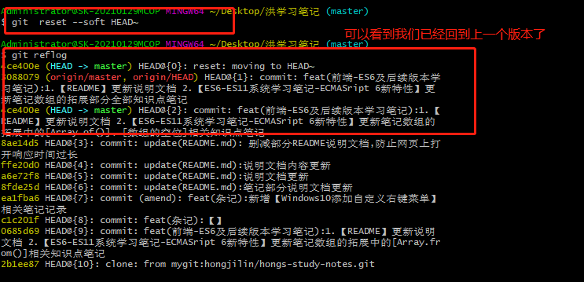
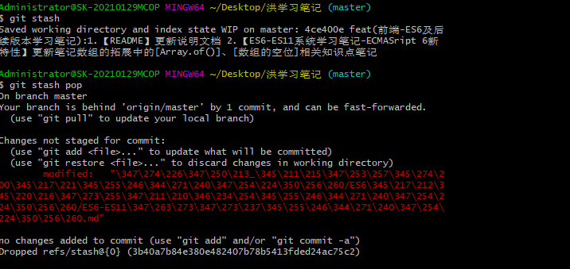
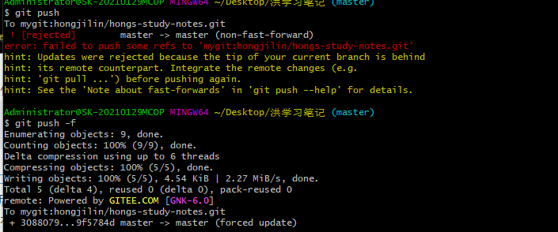
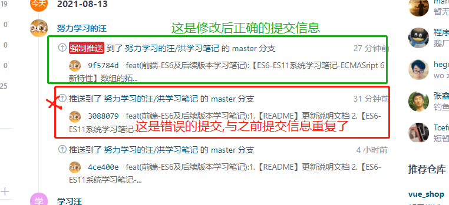

# 🌈Git操作

## 一、初始化

> 该处是用来提交时当作签名使用的

```shell
git config --global user.name "我的用户名"
git config --global user.email "我的邮箱"
#删除配置信息
git config --global --unset user.name
git config --global --unset user.email
```

## 二、Git工作流程与区域

### 1、区域

1. 工作区

   > 平时写代码的文件目录

2. 暂存区

   > git add 后提交暂存的地方

3. 版本库

   > git commit 后给你生成版本的地方,注意push是提交到远程仓库而不是版本库,请勿混淆

### 2、工作流程

> 每个项目都有一个Git目录(.git)他是Git用来保存元数据和对象数据库的地方.该目录非常重要,每次克隆镜像仓库的时候,实际拷贝的就是这个目录里的数据

##### ①、在工作目录中修改某些文件

>从项目中取出某个版本的所有文件和目录,用以开始后续工作的叫做工作目录,这些文件实际上都是从Git目录中的压缩对象数据库中提取出来的,接下去就可以在工作目录中对这些文件进行编辑

##### ②、保存到暂存区域,对暂存区做快照

> 暂存区域只不过是个简单的文件,一般都放在Git目录中,有时候人们会把这个区域的文件叫做索引文件,不过标准说法还是叫暂存区域

##### ③、提交更新

> 将保存区在暂存区域的文件快照永久转储到本地数据库(Git目录)中

我们可以从文件所处位置来判断状态:如果是Git目录中保存着的特定版本文件,就属于提交版本;如果做了修改并已放入暂存区域,就属于已暂存状态;如果自上次去除后,做了修改但还没有放到暂存区域,就是已修改状态

## 三、对象详解(底层命令)

### 1、git对象

> 1. key:val 组成的键值对(key是val相应的hash)
>
> ​		键值对在git内部是blob类型(git特有)
>
> 2. 存储数据文件内容,也称为数据对象

##### ① 直接写入git对象方法与读取(存入".git/objects")

```shell
#将打印内容写入对象(git数据库)并且返回其相应哈希值
echo "写入的对象内容" | git hash-object -w --stdin 
#读取内容并不能直接cat读取,因为git存入时已经加密,需要如下代码 -p:内容  -t:类型
git cat-file -p 存入对象的哈希值(此值可以由上一步得到) 
#将文件写入git对象,即我们常见的版本控制中出现的
git hash-object -w ./test.txt
#查看Git存储的数据  返回其文件夹内的所有哈希文件
find .git/objects -type f 
```

### 2、树对象

> 树对象是存储键值 作用为控制版本,如我们的版本前回退 就是在操作这个对象的(指向改变)
>
> 作用就是生成快照
>
> 这个也是git的必杀特性,因为他的切换分支与版本都很快 只是指针切换

构建树对象

> 我们可以通过 update-index , write-tree , read-tree 等命令来构建树对象并且塞到暂存区

利用 `update-index` 命令 创建暂存区

>利用 `update-index` 命令 为test.txt文件的首个版本创建一个暂存区,并通过`write-tree`命令生成树对象

```shell
#1生成一个树对象
git update-index --add --cacheinfo 100664(文件状态码:普通文件) 哈希值 对应文件名
#生成快照(树对象)
git write-tree
#2 将第一个树对象加入第二个树对象,使其成为新的树对象
git read-tree -prefix=bak 哈希值(树对象的)  
git write-tree
```

查看暂存区当前样子

```shell
git ls-files -s
```

### 3、提交对象

> 1. 通过上述两个对象操作后,你会发现你已经生成了不同项目的快照,但是问题是:如果想重用这些快照,你必须记住所有三个 SHA-1(快照)哈希值 .但是,你也完全不知道是谁保存了这些快照,在什么时刻保存的,以及为什么保存这些快照.而以上这些,正是提交对象(commit object)能为你保存的基本信息
> 2. 我们可以通过调用commit-tree命令创建一个提交对象,为此需要指定一个树对象的SHA-1值,为此需要指定一个树对象的SHA-1值 , 以及该提交的父提交对象(如果有的话,第一次将暂存区做快照就没有父对象)
> 3. 真正的一个版本其实就是提交对象

创建提交对象

```shell
echo "first commit" |git commit-tree 树对象的哈希值
```

指定一个树对象的SHA-1值 , 以及该提交的父提交对象

```shell
echo "second commit" | git commit-tree 提交的树对象哈希值 -p 父亲树对象哈希值
```

## 四、高层命令

### 1、git add  .

>1. 会将工作目录的修改,保存成git对象 `先到版本库,再到暂存区`,而不是直接到暂存区
>
>2. 在工作目录修改几个文件,就会生成几个git对象(一个文件对应一个git文件)
>
>3. 同一个文件,每次修改再add的时候都会生成一个新的git对象,是`增量`而不是覆盖
>4. 所以说git是绝对安全的,就算我只存到暂存区没有提交 git也会给我保存
>5. 只有后面提交的时候,才会根据暂存区内容给我生成树对象并存入版本区,然后加上我们的提交信息,才生成提交对象存入版本库

```shell
#相当于以下两个命令集合
git hash-object -w 文件名(修改了多少个工作目录中的文件,就要被执行几次)
git update-index ...
```

### 2、git  commit -m "注释内容"

> 将暂存区提交到版本库

```shell
git write-tree
git commit-tree
```

> 跳过暂存区存入(之前add过的,直接提交)

```shell
git commit -a -m ""
```

### 3、git init 

> 初始化仓库 初始化后,在当前目录下出现一个名为.git的文件夹

### 4、git status

> 查看文件的状态

### 5、git diff

1. 当前做的那些更新没有暂存?

   命令:`git diff`(不加参数直接输入git diff)

2. 有哪些更新已经暂存起来准备好了下次提交

   命令:`git diff --cached`或者`git diff --staged(1.6.1以上版本)`

### 6、git log

> 1. `git log`(不带参数)
>
>    `空格键`往下翻页 `b`向上翻页 `q`退出日志查阅
>
> 2. git log --oneline 
>
>    将日志信息拍成一行显示
>
> 3. git reflog
>
>    所有的日志信息
>
> 4. git log --oneline --decorate --graph --all
>
>    查看所有的分支信息命令

### 7、git rm 

> 删除工作目录对应的文件,再将修改添加到暂存区(如同删除后给你用了 `git add 文件名`)

```shell
#删除命令
git rm 文件名 
#直接提交修改,因为rm命令帮你提交到暂存区了
git commit -m "xxx"
```

### 8、git mv

>将工作目录中的文件进行重命名,再将修改添加到暂存区

```shell
git mv 原文件名  新文件名
```

## 五、配别名

> Git并不会在你输入部分命令时自动推断出你想要的命令,如果不想每次都输入完整的Git命令,可以通过git config 文件来轻松为每一个命令设置一个别名
>
> 此处运行后将会写入你的配置文件,可以进入配置文件直接删除

```shell
git config --global alias.自定义命令 " `git` 命令后面的指令 "
#如配置查看分支信息 "git log --oneline --decorate --graph --all"
git config --global alias.logbranch "log --oneline --decorate --graph --all"
#配置切换分支
git config --global alias.co checkout
#使用方式
git logbranch
```

## 六、分支

> 1. 前言:
>
>    几乎所有的版本控制系统都以某种形式支持分支.使用分支意味着你可以把你的工作从开发主线上分离开来,以免影响开发主线.在很多版本控制系统中,这是略微低效的过程--常常需要完全创建一个源代码目录的副本,对于大项目来说,这会耗费很多时间,而Git的分支模型极其的高校轻量,是Git的必杀特性,也正因为这一特性,是的Git从众多版本控制系统中脱颖而出
>
> 2. 分支的本质:
>
>    `Git的分支,其实本质上是提交对象`,,所有的分支都有机会被HEAD引用(`HEAD一个时刻只会指向一个分支`),当我们有新的提交的时候 HEAD会携带当前持有的分支向前移动
>
>    Git的默认分支名字是master,在多次提交后,你其实已经有一个指向最后那个提交对象的master分支.他会在每次的提交操作中自动向前
>
>    注意:Git的"master"分支并不是一个特殊分支.她就跟其他分支完全没有区别.之所以几乎每个仓库都有master分支,是因为`git init`命令默认创建它,并且大多数人懒得区改动它
>
> 3. 分支的原理:
>
>    1. `.git/refs`目录中保存了分支及其对应的提交对象
>
>    2. 当运行类似于`git branch (branchname)`这样的命令时,Git会取得当前所在分支最新提交对应的SHA-1值,并将其加入你想要创建的任何新分支中
>
>    3. 当你执行`git branch (branchname)`时,Git如何知道最新提交的SHA-1值呢?答案是HEAD文件
>
>       `HEAD文件`是一个符号引用(stmbolic reference),指向目前所在的分支.所谓符号医用,意味着它并不像普通引用那样包含一个SHA-1值.它时一个指向其他引用的指针

### 1、git branch 

> 1. git branch(不加参数)
>
>    作用:`显示所有分支`信息
>
> 2. git branch 分支名
>
>    作用:`创建分支`
>
> 3. git branch -v
>
>    作用:查看每一个分支最后一次提交
>
> 4. git branch -d(-D强制删除) 分支名
>
>    作用:`删除分支`,小d需要你这个分支是干净的才能删除(如已合并)
>
> 5. git branch --merged 
>
>    作用:查看那些分支已经合并到当前分支
>
>    在这个列表中的分支名字前没有*号的分支通常可以使用`git branch -d` 删除掉
>
> 6. git branch --no-merged
>
>    作用:查看所有包含未合并工作的分支
>
>    尝试使用`git branch -d`命令删除在这个列表中的分支时会失败,如果真的想要删除分支并丢掉哪些工作,可以使用`-D` 选项爱强制删除它
>
> 7. git log --oneline --decorate --graph --all
>
>    作用:查看所有的分支信息命令
>
> 8. git branch 分支名 commitHash
>
>    作用:新建一个分支,并且使分支指向对应的提交对象(版本穿梭`可以替代撤销与重置`)

### 2、git checkout 分支名

> 作用:`切换分支`  checkout还有其他作用,后面会提到
>
> 它会动三个地方:HEAD(指针) 暂存区 工作目录

> 1. `注意`:分支切换会改变你工作目录中的文件,所以在切换分支时,一定要注意你的工作目录里的文件会被改变,如果时切换到一个比较旧的分支,你的工作目录会回复到该分支最后一次提交的样子,如果Git不能干净利落的完成这个任务,它将禁止切换分支
>
> 2. `坑`:在切换分支时, 如果当前分支上由未暂存的修改(`第一次`) 或者 有未提交的暂存`(第一次`) 分支可以切换成功,但是这种操作可能会污染其他分支
>
>    ps:`第一次`--当前分支如果已经提交过一次,将不让你切换,但是第一次没有提交过,git会帮你保存文件 但是它并不知道新增修改是属于哪个分支,所以会带回当前分支
>
> 3. 最佳操作方式:`每次在切换分支前,需要提交一下当前分支(先使用status查看状态)`

### 3、git checkout -b "新的分支名"

> 创建并进入该分支,类似于上面两个命令集合

### 4、模拟实战流程

>1. 需要解决主程序的的一个小BUG,所以使用`git  checkout -b "iss_bug"`新建分支并在这个分支进行bug调修
>
>2. 
>
>3. 当你将紧急bug修复后,进行提交,确定status干净后切换回master分支,进行合并:代码如下
>
>```shell
>git checkout master
>git merge hit_bug
>```
>
>4. 修改完后再查看status(这是个好习惯,防止偶尔记忆混淆造成不必要的麻烦),再切换至普通bug分支`iss_bug`进行修改,成功后切换回去合并
>5. 如果出现冲突,去出现冲突的文件手动修改(决定保留那部分代码),再进行`git add`表示冲突解决,在进行提交 

### 5、合并分支

> 命令: `git merge branchname`(分支名)
>
> 注意:合并分支时要先切换到`主要分支`(即下面的被合并分支),在这个分支上进行合并新分支,使得这个分支进行版本更新
>
> 1. 快进合并-->不会产生冲突
>
>    ​		指被合并分支并没有进行修改,停留在原地,只有新分支进行修改更新,更		新完成后进行合并,原版本相当于直接前进版本,称为快进合并
>
> 2. 典型合并-->有可能产生冲突
>
>    ​		指被合并分支在新分支进行开发时,本身也进行修改开发,可能会改动到同		一代码或者文件而产生重复修改
>
> 3. 解决冲突:`打开冲突的文件`  进行修改 ,修改完成后进行:`add标记修改完成`,然后commit进行提交

>`git 在pull或者合并分支`的时候有时会遇到一个第一段是黄色,下面文字是青色(偏蓝色)。可以不管(直接下面3,4步)，如果要输入解释的话就需要:
>
>1.按键盘字母 i 进入insert模式
>
>2.修改最上面那行黄色合并信息,可以不修改
>
>3.按键盘左上角"Esc"
>
>4.输入":wq",注意是冒号+wq,按回车键即可

## 七、存储

> 1. 需求背景:
>
>    有时,当你在项目的一部分上已经工作了一段时间后,所有东西都进入了混乱的状态,而这时你想要切换到另一个分支做一点别的事情.问题是,你不想仅仅因为过会儿回到这一点而做了一半的工作创建一次提交
>
> 2. 解决:
>
>    针对这个问题的答案是 `git stash` 命令(当然,直接提交`commit`也可以,这个是用来不想生成提交对象而用)
>
> 3. 原理:
>
>    git切换分支之所以保留你的未提交的修改文件,是因为它不想你因为误操作使得之前代码报废所以会当你status不干净时组织你切换分支(`ps`:如果是第一次创建的文件没有追踪过,它不认识是属于那份分支将会带到你切换后的分支造成污染),
>
>    而你将其保存到栈上(`ps`:换句话说将这部分内容抽取到一个类似共有的栈上,你在哪个分支都能够通过命令取到),git就知道你这个内容已经储存并不会造成切换分支使得你写的代码丢失,便不会阻止你切换分支或者切换带文件污染分支

### 1、git stash

> `git stash`命令会将未完成的修改保存到一个栈上,而你可以在任何时候重新应用这些改动(`git stash apply`),
>
> `注意!!!!!`:使用前你要先`git add .`,否则你会发现,你执行此命令后,没有追踪的部分全部消失了

### 2、git stash list 

> 查看存储

### 3、git stash pop

> 来应用储藏然后立即从栈上扔掉它 `这是最推荐的使用`

### 4、'git stash apply stash @{2}'

> 如果不指定一个储藏,git认为指定栈顶`不常用`

### 5、git stash drop "储藏的名字"

>加上要储藏的名字移除他 `不常用`

### 6、git stash clear 

> 在查看存储后,运行此命令  清空stash栈

## 八、撤销与重置

> 特别是重置部分理解即可(用到了再去查),撤销尽量可以掌握

### Ⅰ- 撤销

#### 1、git commit --amend

> 1. 这个命令会将暂存区中的文件提交,修订提交(`不是撤销而是重新提交`)
>
> 2. 如果自上次提交以来你还未做任何修改(如:在上次提交后马上执行此命令),那么快照会保持不变,而你修改的只是提交信息
>
> 3. 如果你提交后发现忘记了暂存某些需要的修改,可以像下面这样操作
>
>    ```shell
>    git commit -m "错误的注释" #或者commit了错误的修改
>    git add "文件名或者."  #重新add正确的文件
>    git commit --amend		#进行重新提交
>    ```
>
>    最终你只会有一个提交 (第二次提交将会替代第一次提交)
>
> 4. 可以修改上次提交的文件与注释

#### 2、git reset 

>1. 一般我们写完代码后,是这样提交的:
>
>  - git add . //添加追踪所有文件
>  - git commit -m "feat(前端-Git学习详细笔记):更新撤销commit操作" //添加commit提交信息
>
>2. 但是commit写完提交信息后,突然想到还有一个地方代码没改到/保存,如果放到下一个commit却不合适(同一个功能修改,分成两个commit),原因详见下方的 [版本控制工具的使用基本原则](https://gitee.com/hongjilin/hongs-study-notes/tree/master/编程_前端开发学习笔记/Git学习笔记#Ⅳ-版本控制工具的使用基本原则) 
>3. 执行此命令命令:`git reset --soft HEAD^`
>
>  - HEAD^的意思是上一个版本，也可以写成HEAD~1
>  - 如果你进行了2次commit，想都撤回，可以使用HEAD~2
>  - 详见下方 [reset三部曲](https://gitee.com/hongjilin/hongs-study-notes/tree/master/编程_前端开发学习笔记/Git学习笔记#reset三部曲)
>
>作用:将文件从`暂存区中撤回`到工作目录中(仅仅是撤回commit操作，你写的代码仍然保留)

#### 3、git checkout

>是的,你没看错,这个是切换分支的命令,但是他也能用来`撤销文件修改`
>
>命令:`git checkout --文件名`
>
>将在工作目录中对文件的修改撤销
>
>`注意`:这是一个危险的命令,这很重要.你对那个文件做的任何修改都会消失--你只是拷贝了另一个文件(原来版本的文件)来覆盖它.除非你确实秦楚不想要那个文件了,否则不要使用这个命令

### Ⅱ - 重置reset

> 注意:`--hard`标记是`reset`命令唯一的`危险用法`,也是Git真正的销毁数据的几个仅有操作之一.其他任何形式的`reset`调用都可以轻松撤销,但是`--hard`选项不能,因为它强制覆盖了工作目录中的文件.
>
> 如在这种特殊情况:我们的Git数据库中的一个提交内还留有该文件的几个版本,我们可以通过`reflog`来找回它,但若是该文件还未提交,Git仍会覆盖他导致它无法恢复

#### reset三部曲

>第一部:git reset --soft HEAD~(等于之前的--amend,后面如果跟随数字,就是回退几个版本,默认1个)
>
>​	移动HEAD (但带着分支一起移动,与checkout不同(它只动HEAD))  -->相当于回到你没有 [ commit ]的时候,代码仍在
>
>第二部:git reset --mixed HEAD~
>
>​	移动HEAD 并且动了了暂存区
>
>第三部:git reset --hard HEAD~
>
>​	移动HEAD 并且动了了暂存区 动了工作目录 ( 你的提交的代码也会没掉 )

### Ⅲ -  错误的git push提交成功后如何撤销回退

>我们在使用Git进行版本控制时，有可能会出现这种情况。git push后发现提交的内容不是想要的，这时候我们怎么做呢，提交上去的内容是没有删除按钮的（比如github，或码云）。所以我们需要一些手段将提交上去内容撤销下来。
>
>而要撤销,就要用到上面所学的 `git reset`

#### 1、错误场景示范

>Ⅰ- 当我撰写 [ commit ] 信息没注意到,以为是对的时候直接提交 --> 因为本人提交笔记时喜欢按 [ ↑ ] 找到之前的提交信息进行修改
>
> 
>
>Ⅱ- 此时可以看到,错误的 [ commit ] 已经提交了 (当然,适用场景不只是commit ,也可错误代码之类的)
>
> 

#### 2、回退操作

>咱们操作稳重一点,使用git reset --soft HEAD~就好了(如果回退后代码也不想要,可以用`git stash`,暂存,达到代码也回退的效果)

##### ① git reflog

>commits，它在git中扮演了一个重要角色，我们平常用的一些操作git clone ,git commit 都会产生commits，通俗的讲这个就是版本号，但是git reset并不会产生commits（不是不会产生，而是会产生 但是都是一样的），我们可以先看看自己项目中的commits，使用如下命令:`git reflog`
>
> 

##### ②  git  reset --soft HEAD~

>运行此代码后,我们的 [ HEAD ] 指向了上一个 [ commits ]
>
> 

##### ③  查看缓存

> * 此时你可以用`stash staus`查看,会发现,之前提交的代码已经放回缓存区了
>
> * 如果你不想要此次提交所有代码,可以使用`git stash` ,然后再去清空即可(当然,本人此处还是需要的,所以要留下)
>
>    

##### ④ 重新撰写 [ commit ]信息

> 

##### ⑤ 强制提交

>如果你重新撰写 [ commit ] 后马上重新push,你会发现无法提交: 因为我们当前落后远程一个版本!
>
>所以此时直接强制提交即可,就能覆盖远程提交记录
>
>>`git push -f`
>
> 

#### 3、成功展示

>* 在网站工作台首页能看到已经将更改后的 [ coommit ] 强制推送上来了
>
> 也许你会奇怪:为啥工作台上还能看到? 其实已经删了!!!你看下方
>
> 
>
>* 但是你查看提交记录,会发现之前错误的commit已经被覆盖
>
>

## 九、数据恢复

> 在你使用Git的时候,你可能会意外丢失一次提交:
>
> ①通常这是因为你强制删除了正在工作的分支,但是最后你却需要这个分支;②抑或是你硬重置了一个分支,放弃了你想要的提交.
>
> 如果这些事情已经发生,该如何找回你的提交呢?

### 实例

> 推荐方法最好是`直接看恢复`,上面实例时当你使用硬重置回当初未删除版本进行恢复,出现的一系列问题解决

>1. 假设你已经提交了五次,而现在,我们将master分支硬重置到了第三次提交来找回当时删除的分支.但是这时候你会发现一个事情:
>
>现在顶部的两个提交已经丢失了-没有分支指向这些提交(因为你将指针移到了第三个,那么前面两个就找不到了)
>
>2. 你现在已经得到并且恢复当时第三次还存在的的提交了(`恢复方法在下面,恢复文件到这步,下面3、4是回到最新版本`)
>
>现在准备回到当初最新的版本时,你发现你进行打印竟然没有前面两次提交信息(你需要他的哈希值进行版本穿梭或者重置),你需要最新一次提交的哈希值,但是你估计想不起来了,对吗?
>
>3. 最方便,也是最常用的方法,是使用一个名叫`log reflog`的工具(前面高层命令提过),当你在工作时,Git会默默记录每一次你改变的HEAD时它的值,每一次你提交或者改变分支,引用日志都会被刷新
>
>4. 如果`git reflog`显示的内容你觉得不足够多,可以执行`git log -g`,这个命令会以标准日志的格式输出引用日志

### 恢复 `推荐的`

> 1. 通过`git reflog`找到你需要的文件还未删除的版本哈希值,那个就是你丢失的提交,你可以通过创建一个新的分支指向这个提交来恢复它.
>
>    例如:你可以创建一个名为`recover-branch`的分支执行这个提交
>
>    ```shell
>    git branch recover-branch 当前需要恢复(之前丢失的)的提交哈希值
>    ```
>
> 2. 现在有一个名为`recover-branch`的分支是你的`master`分支曾经指向的地方(即当时你删除该需要的文件的前的那个版本),这样你在这次提交的版本后,也能通过切换这个分支得到曾丢失的文件
>
> 3. 这个分支功能能帮你做很多东西,善用分支,Git最强功能

## 十、打tag

> Git可以给历史中的某一次提交打上标签,表示重要.比较有代表性的是人们会用这个功能来`标记发布节点`(v1.0等等)

### 1、列出标签

>命令:`git tag` 或者 `git tag -l 'v1.*'`
>
>​	前者列出所有,后者列出以`v1.`开头的所有

### 2、创建标签

> git使用两种主要类型的标签:轻量标签 与 附注标签

##### ①轻量标签

> 轻量标签很像一个不会改变的的分支(他只是一个特定提交的引用),直接在提交前使用命令即可给当前分支打上标签

```shell
git tag v1.0
#或者下面的
git tag v1.0 提交对象哈希
```

##### ②附注标签

> 附注标签是存储在Git数据库中的一个完整对象.他们是可以被校验的,其中包含打标签者的名字、电子邮件地址、日期时间;通常`建议创建复制标签`,这样你可以拥有以上所有信息,但如果只是想用一个临时标签,或者由于某些原因不想表村那些信息,轻量标签也是可用的

```shell
git tag -a v1.0
git tag -a v1.0 提交对象哈希
git tag -a v1.0 提交对象哈希 -m "我的注释信息"
```

### 3、查看特定标签

> `git show` 可以显示任意类型的对象(git对象 树对象 提交对象 tag对象)
>
> 命令: `git show tagname`

### 4、删除标签

> 1. 删除标签 要删除你在本地仓库上的标签,可以使用命令 `git tag -d <tagname>`如下:
>
>    ```shell
>    git tag -d v1.0
>    ```
>
> 2. 应该注意上述命令并不会从任何远程仓库中移出这个标签,你必须使用`git push <tamote>:refs/tags/<tagname>`来更新你的远程仓库,如下
>
>    ```shell
>    git push origin :refs/tags/v1.0
>    # origin是你配置的远程仓库地址别名,你可以直接用远程仓库地址
>    ```

### 5、捡出标签

> 1. 如果说你想查看某个标签所指向的文件版本,可以使用`git checkout`命令
>
>    ```shell
>    git checkout tagname
>    ```
>
> 2. 虽然说这会使得你的仓库处于"分离 头指针(deacthed HEAD)"状态.在"分离头指针"状态下,如果你做了某些更改然后提交它们,标签不会发生变化,但你的新提交将不属于任何分支,并且将无法访问,除非访问确切的提交哈希,因此你如果需要进行更改--比如说你需要`修复旧版本`的错误--这通常需要创建一个新的分支(捡出后创建,就会默认将当前捡出的版本作为新分支的第一版本-前面分支提到过)
>
>    这样就可以修改到旧版本的代码(如同vue的尤雨溪在vue3.x会更新vue1.0版本生态)
>
>    ```shell
>    git checkout -b version(新的分支)
>    ```

# 🌈代码风格


## 1、commit提交规范

>1. [参考自阮一峰老师的文章](http://www.ruanyifeng.com/blog/2016/01/commit_message_change_log.html)
>
>2. Header
>
>Header部分只有一行，包括三个字段：`type`（必需）、`scope`（可选）和`subject`（必需）。
>
>**（1）type**
>
>`type`用于说明 commit 的类别，只允许使用下面几个标识。
>
>> ```js
>> feat：新功能（feature）。
>> fix/to：修复bug，可以是QA发现的BUG，也可以是研发自己发现的BUG。
>> fix：产生diff并自动修复此问题。适合于一次提交直接修复问题
>> to：只产生diff不自动修复此问题。适合于多次提交。最终修复问题提交时使用fix
>> docs：文档（documentation）。
>> style：格式（不影响代码运行的变动）。
>> refactor：重构（即不是新增功能，也不是修改bug的代码变动）。
>> perf：优化相关，比如提升性能、体验。
>> test：增加测试。
>> chore：构建过程或辅助工具的变动。
>> revert：回滚到上一个版本。
>> merge：代码合并。
>> sync：同步主线或分支的Bug。
>> ```
>
>如果`type`为`feat`和`fix`，则该 commit 将肯定出现在 Change log 之中。其他情况（`docs`、`chore`、`style`、`refactor`、`test`）由你决定，要不要放入 Change log，建议是不要。
>
>**（2）scope**
>
>`scope`用于说明 commit 影响的范围，比如数据层、控制层、视图层等等，视项目不同而不同。
>
>**（3）subject**
>
>`subject`是 commit 目的的简短描述，不超过50个字符。
>
>> - 以动词开头，使用第一人称现在时，比如`change`，而不是`changed`或`changes`
>> - 第一个字母小写
>> - 结尾不加句号（`.`）

